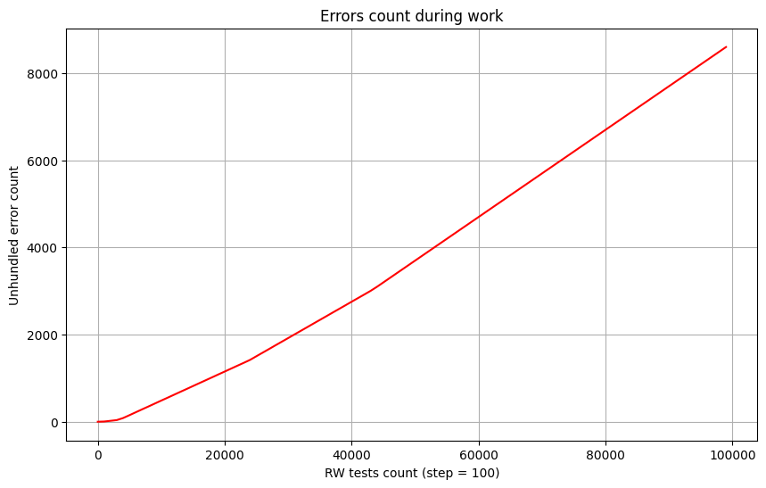

# Noise-Immune FAT32 File system
## Main goal
The main goal of this project is to make the FAT32 filesystem simpler, more secure, and make it work in use cases where `SEU` is common. </br> 
A secondary goal is to make this filesystem work on embedded systems for my other project called [CDBMS](https://github.com/j1sk1ss/CordellDBMS.PETPRJ) and update the core functionality to a thread-safe context.

## Why?
- Firstly, I have my own project that needs a noise-immune FS.
- Secondly, we currently have ECC RAM, but we have no way to protect data in non-ROM memory from SEU.
- Thirdly, it will be cheaper if we can use software solutions instead of hardware ones.
- Fourthly, although modern file systems like exFAT, ZFS, and NTFS offer advanced features and are designed to work in a wide range of environments, they generally lack built-in mechanisms for error correction at the level of individual data blocks. While some (like ZFS) provide error detection through checksums and metadata validation, they do not implement true error correction codes (ECC) such as Hamming or Reed–Solomon, which can autonomously recover corrupted bits.

## Abstract
It is notable that, across the entire internet, there are virtually no serious attempts to revive or modernize the [FAT32](https://wiki.osdev.org/FAT) file system for embedded or desktop systems. Typically, developers and users transition to more modern alternatives like [EXT4](https://wiki.osdev.org/Ext4) (or [LittleFS](https://github.com/littlefs-project/littlefs) in the context of embedded systems) due to the well-known limitations of `FAT32`. However, in doing so, they often abandon the core advantage of `FAT32`: its simplicity. And as we all know, reducing complexity is one of the most effective ways to reduce errors. </br>
`NIFAT32` is a project designed to bring FAT32 back to life — adapted specifically for embedded platforms such as the [STM32F103C6T8](https://www.st.com/en/microcontrollers-microprocessors/stm32f103c6.html), as well as for hobbyist operating systems like my own — [CordellOS](https://github.com/j1sk1ss/CordellOS.PETPRJ) with noise-immune solutions. For this purpose, the file system must remain lightweight and optimized for a single-threaded environment. </br>

**Why choose `FAT32` as a base?**  </br>
The answer is simple: `FAT32` is a well-known and widely supported file system, with a clean and understandable structure. Its internal layout is easy to follow, and that makes it an excellent candidate for low-level experimentation and enhancements. Furthermore, `FAT32` presents clear opportunities for being adapted to environments affected by [SEU](https://en.wikipedia.org/wiki/Single-event_upset) events or requiring robust error handling in embedded contexts.  

In particular, the following components are prime candidates for such upgrades:
- The File Allocation Table, which defines the core logic and structure of the file system.
- `directory_entry_t`, the fundamental structure used to represent files and metadata.
- Boot sector with all critical file system data.

## Why SEU is dangerous?
Well, `SEU` — or *Single Event Upset* — is a physical phenomenon that occurs when energetic particles (typically ionic radiation) disrupt the state of electrons in microelectronic components such as the `CPU`, `RAM`, and other circuits. This type of event can be catastrophic, especially in systems where safety and reliability are critical — for example, in avionics or onboard spacecraft control systems. For this reason, any software intended to run in such high-reliability environments must be designed with `SEU` resilience in mind. </br>
Of course, there are existing hardware-level techniques to mitigate the effects of SEU, such as:
- [ECC (Error-Correcting Code)](https://community.fs.com/encyclopedia/ecc-memory.html)
- [ROM (Read-only memory)](https://en.wikipedia.org/wiki/Read-only_memory)

However, there's an important limitation: these methods (in case with `ECC`) typically operate on `RAM`, not on `Flash` memory. This means that while data stored in volatile memory (RAM) can often be automatically corrected if flipped by radiation, the same guarantees do not apply to `RWM` (read/write memory, such as Flash). </br>
When it comes to `ROM`, the situation is different due to its immutable nature and underlying physical properties. As explained in this [article](https://hackernoon.com/differences-between-ram-rom-and-flash-memory-all-you-need-to-know-ghr341i), ROM is inherently more resistant to SEUs thanks to the way it's physically implemented.  

## Impact of SEU
To validate the potential impact of SEU on program stability, a controlled test environment was developed featuring fault-injection mechanisms that directly target memory. While it's understood that, in real-world scenarios, programs typically reside in RAM protected by ECC (Error-Correcting Code) — which mitigates bit-flipping — the **data used and stored by the program remains vulnerable**. </br>
This subtle but crucial detail can lead to significant reliability issues and degraded user experience.  
For example, in our tests, once around **200,000 bit flips** had occurred, the standard FAT32 file system (even with checksum support) began to fail while working with file records:

```
...
[WARN] (nifat32.c:188) directory_entry_t checksum validation error!
[ERROR] (nifat32.c:522) Entry not found!
Can't open content!
Hundled error count: 10000
Unhundled error count: 0
```

This issue arises from a bit-flip within the `directory_entry_t` file name field: </br>
One such flip occurred in the file name `"TEST    TXT "`, resulting in it becoming `"TEST   0TXT "` due changing symbol ' ' (dec=32, bin=100000) to symbol '0' (dec=48, bin=110000). This change triggered a checksum verification failure. </br>
However, this scenario **should not be considered as a major improvement**. In the original FAT32, a similar bit-flip would simply corrupt the file name and result in the classic `"File not found"` error.  
The difference is that in this modified version, the error is **accompanied by a clear diagnostic** — a checksum verification failure — which aids in identifying the source of corruption. </br>
For a visual reference, below are the results of testing the **unmodified FAT32** system with **only checksum implementation enabled** with dynamic bit-flip injection: </br>
(X-axis: number of bit-flips in data, Y-axis: count of handled errors)

<p align="center">
	
</p>

However, according to the test data, the bit-flip occurred in the most critical area — the File Allocation Table (FAT) and its copies (or directly in the root `directory_entry_t`). As a result, this particular test case does not provide much insight, since the outcome is both expected and obvious: the `FAT32` file system was **not designed** to withstand upset events. </br>
The original implementation can handle certain types of corruption, such as partial damage to the boot sector or the FAT itself (as long as the actual cell values remain untouched). However, it fails to operate reliably when an `SEU` occurs within clusters — for example, altering a file name directly or breaking the cluster chain in the main FAT. According to the specification, `FAT32` reads data only from the main FAT and synchronizes it with its copies **only during write operations**. </br>
Despite this, `FAT32` remains a solid and proven solution for simple file storage in embedded systems. This is why introducing **modifications** to improve noise immunity and fault tolerance makes sense. Moreover, since our primary target is embedded systems, the source code can be **restructured and simplified** to reduce its overall footprint, making it easier to port across various microcontrollers.

## File Allocation Table
As mentioned earlier, the `File Allocation Table (FAT)` is the most critical component of the `FAT32` file system. I won't go into detail on how this table works — for that, refer to this [topic](https://en.wikipedia.org/wiki/Design_of_the_FAT_file_system). </br>
In the original FAT32 implementation, the entire table (and usually one additional copy) is stored in the first sectors of the disk. When we consider `Flash` memory — which is one of the cheapest storage solutions in terms of capacity-to-cost ratio ([see article](https://nexusindustrialmemory.com/choosing-between-flash-and-eeprom-finding-the-perfect-memory-type-for-your-embedded-system)) — this design introduces several risks, especially in `embedded` systems affected by `SEU` (Single Event Upset), as described [here](https://en.wikipedia.org/wiki/Flash_memory). </br>
The main issue is that `SEU` events can disturb electron states in `Flash` memory, causing bit-flips that silently corrupt data. If the `FAT` table is affected, this may lead to:
- a corrupted boot sector,
- a corrupted file allocation table,
- broken file allocation metadata,
- unreadable or incorrectly linked files,
- or even complete file system failure.

Therefore, storing such a critical structure in unprotected `Flash` — without error correction or redundancy — makes the system highly vulnerable to undetectable corruption. </br>
According to the official FAT32 specification, additional FAT table copies (usually one) are used only as a fallback when the primary FAT is detected as corrupted:

```
Typically the extra copies are kept in tight synchronization on writes, and on reads they are only used when errors occur in the first FAT.
``` 

This recovery strategy can be significantly improved by introducing a **voting system**. Instead of relying on a single backup, the system would store multiple FAT copies and resolve discrepancies by selecting the most frequently occurring valid value (majority voting). Afterward, all copies can be re-synchronized based on the voted result. This increases resistance to undetected bit errors and improves overall robustness in SEU-prone environments. </br>
The final algorithm is simple: </br>
We allocate a buffer for the table and fill it by reading from disk using majority voting. On write, we update all FAT copies to maintain consistency:

```
int write_fat(cluster_addr_t ca, cluster_status_t value, fat_data_t* fi) {
    if (ca < fi->root_cluster || ca > fi->total_clusters) return 0;
    if (_fat) _fat[ca] = value;
    for (int i = 0; i < fi->fat_count; i++) __write_fat__(ca, value, fi, i);
    return 1;
}

cluster_val_t read_fat(cluster_addr_t ca, fat_data_t* fi) {
    if (ca < fi->root_cluster || ca > fi->total_clusters) return 0;
    if (_fat && _fat[ca] != FAT_CLUSTER_BAD) return _fat[ca];

    int wrong = -1;
    int val_freq = 0;
    cluster_val_t table_value = FAT_CLUSTER_BAD;
    for (int i = 0; i < fi->fat_count; i++) {
        cluster_val_t fat_val = __read_fat__(ca, fi, i);
        if (fat_val == table_value) val_freq++;
        else {
            val_freq--;
            wrong++;
        }

        if (val_freq < 0) {
            table_value = fat_val;
            val_freq = 0;
        }
    }

    _fat[ca] = table_value;
    if (wrong > 0) {
        write_fat(ca, table_value, fi);
    }

    return table_value;
}
```

But error-correcting coding of the whole FAT is necessary, according to the test results (see below). Results with static injection of 1 million random bit flips (boot sector decompression and Hamming encoding + FAT decompression and major voting without error-cerrection encoding):

<p align="center">
	
</p>

## Boot structure
FAT32 has many data structures that are used during work. For example in source design we have:
- directory_entry_t - Entry structure that represent any file or directory in file system.
- fat_bootstruct - Basic data of file system and hardware specification. This structure include data about sector size, cluster size, fat offsets. Full list of fields is below:

```
typedef struct fat_BS {
	unsigned char  bootjmp[3];
	unsigned char  oem_name[8];
	unsigned short bytes_per_sector;
	unsigned char  sectors_per_cluster;
	unsigned short reserved_sector_count;
	unsigned char  table_count;
	unsigned short root_entry_count;
	unsigned short total_sectors_16;
	unsigned char  media_type;
	unsigned short table_size_16;
	unsigned short sectors_per_track;
	unsigned short head_side_count;
	unsigned int   hidden_sector_count;
	unsigned int   total_sectors_32;
	unsigned char  extended_section[sizeof(fat_extBS_32_t)];
} __attribute__((packed)) fat_BS_t;
```

- The fat32_bootstruct itself actually refers to the `fat_bootstruct`, which historically contains information only for FAT12 and FAT16 filesystems. That’s why, to support FAT32, the bootstruct includes a special field called the extended_section.

The main idea here is to enhance reliability by introducing **checksum support** alongside a **dual-backup system** that uses **noise-immune encoding**. The additional checksum verification significantly reduces the probability of undetected data corruption. </br>
For checksum generation, the `crc32` function was used, implemented as described in this [article](https://arxiv.org/html/2412.16398v1). Why `crc32`? It is a well-established and widely adopted error-detection algorithm with strong guarantees for catching common types of data corruption. Its effectiveness and performance characteristics are also analyzed in this [thesis](https://theses.liacs.nl/pdf/2014-2015NickvandenBosch.pdf). </br>
To further enhance protection, **Hamming code** was chosen as the noise-immune encoding method. The reasons for this choice and specific implementation details will be discussed in the following sections. </br>
In the original FAT32 design, the boot structure is stored in the first sector, with a backup typically located in the sixth sector. However, this fixed-location approach can be fragile. To improve fault tolerance, a strategy of **“decompression” storage** is proposed. This involves placing backup copies at sector addresses derived using a formula based on [hash constants](https://en.wikipedia.org/wiki/Golden_ratio), such as the golden ratio. This spreads backups across the storage space, reducing the chance that a localized SEU or memory wear-out event will affect both the original and its backup.

```
#define HASH_CONST 2654435761U
#define BS_PRIME1 73856093U
#define BS_PRIME2 19349663U
#define BS_PRIME3 83492791U
#define GET_BOOTSECTOR(number, total_sectors) ((((number) * BS_PRIME1 + BS_PRIME2) * BS_PRIME3) % (total_sectors))
```

```
Ext boot checksum: 2706677872
Boot checksum: 2250935889
[i=0] encoded bootsector has been written at sa=37545/131072!
[i=1] encoded bootsector has been written at sa=58404/131072!
[i=2] encoded bootsector has been written at sa=79263/131072!
[i=3] encoded bootsector has been written at sa=100122/131072!
[i=4] encoded bootsector has been written at sa=120981/131072!
```

This method physically decompress data on disk/flash drive:

<p align="center">
	
</p>

Same method of physical decompression was applied to file allocation table:

```
#define HASH_CONST 2654435761U
#define FAT_PRIME1 79156913U
#define FAT_PRIME2 91383663U
#define FAT_PRIME3 38812191U
#define GET_FATSECTOR(number, total_sectors) ((((number) + FAT_PRIME1 * FAT_PRIME2) * FAT_PRIME3) % (total_sectors))
```

```
FAT written at sa=110657
FAT written at sa=125536
FAT written at sa=9343
FAT written at sa=24222
```

Unfortunately, this solution will make the filesystem unusable for boot sectors in operating systems — unless they implement:
- Hamming-code decoding logic,
- and proper sector address translation.

This breaks compatibility with traditional BIOS or UEFI bootloaders expecting a FAT-like layout. However, this trade-off is acceptable because the primary goal of this filesystem is reliable data storage on external drives. Therefore, boot compatibility is not a requirement at this stage. </br>

## Directory entry
The next step involves modifying the original data structures to optimize them for this embedded solution. For example, the `directory_entry_t` structure. Below is the original definition:

```
typedef struct directory_entry {
	uint8_t file_name[11];
	uint8_t attributes;
	uint8_t reserved0;
	uint8_t creation_time_tenths;
	uint16_t creation_time;
	uint16_t creation_date;
	uint16_t last_accessed;
	uint16_t high_bits;
	uint16_t last_modification_time;
	uint16_t last_modification_date;
	uint16_t low_bits;
	uint32_t file_size;
} __attribute__((packed)) directory_entry_t;
```

And updated version:
```
typedef struct directory_entry {
	unsigned char file_name[11];
	unsigned int  name_hash;
	unsigned char attributes;
	unsigned int  cluster;
	unsigned int  file_size;
	unsigned int  checksum;
} __attribute__((packed)) directory_entry_t;
```

As you can see, in the modified structure, seven fields with a total size of 12 bytes were removed. These fields (creation and last accessed time) were excluded in the `embedded` context to save space. In embedded systems, creation and last usage timestamps are typically unnecessary due to the program’s specific requirements like:
- Saving important data without any time check.
- Reading config data without any time check.
- Updating data without any time check.

An example of such a system could be `CDBMS`, [LittleDB](https://github.com/pouriamoosavi/LittleDB), or [EinkPDA](https://github.com/ashtf8/EinkPDA). </br>
Additionally, the original `high_bits` and `low_bits` fields have been replaced by a single `cluster` field. Historically, splitting addresses into high and low parts was justified by limitations of 16-bit target architectures. However, our current target platforms fully support 32-bit values. The underlying mechanism for handling 32-bit numbers even on 8-bit architectures is described in this [Reddit discussion](https://www.reddit.com/r/arduino/comments/i3wl8f/how_do_8_bit_arduinos_handle_32bit_numbers/). </br>
With this simplification, the size of each `directory_entry_t` structure is significantly reduced. This allows us to store more entries within a single cluster, which in turn reduces the number of system calls and I/O operations required to traverse directories. </br>

For example, assuming a default cluster size of: </br>
`sector_size * 2^3 = 512 * 8 = 4096 bytes` </br>

- The original structure required approximately 26 bytes per `directory_entry_t`, allowing for around 157 entries per cluster.
- The modified structure uses only 18 bytes, increasing the number of entries per cluster to approximately 227.

This optimization leads to better performance and fewer disk accesses. The improvement can be visualized with a graph where:
- **Y-axis** represents the number of I/O operations,
- **X-axis** represents the number of entries in the directory.

<p align="center">
	
</p>

But if we start implementation of error-correction methods such as `Hamming Code` (Hamming code is better for single-bit errors. For large data blocks like stored data or entire FAT, we will use `Reed-Solomon code`. About implementation of this approach we will speak below), we multiply size of modified `directory_entry_t` by 2, and receive something similar to old results: 30 bytes, that in the end will lead to incrementing of syscalls count:

<p align="center">
	
</p>

The main detail here is that error-correction in `directory_entry_t` happens every time we iterate through a cluster.

## Modern solutions against SEU
The most common solution against **Single Event Upsets** (SEUs) is [Hamming encoding](https://en.wikipedia.org/wiki/Hamming_code).  
Another approach for implementing noise-immune encoding is the use of [Reed–Solomon codes](https://en.wikipedia.org/wiki/Reed%E2%80%93Solomon_error_correction). A comparison between these two error correction methods can be found in [this study](https://www.researchgate.net/publication/389098626_A_Comparative_Study_between_Hamming_Code_and_Reed-Solomon_Code_in_Byte_Error_Detection_and_Correction). </br>
Below is a basic implementation of Hamming encoding and decoding.

```
#define GET_BIT(b, i) ((b >> i) & 1)
#define SET_BIT(n, i, v) (v ? (n | (1 << i)) : (n & ~(1 << i)))
#define TOGGLE_BIT(b, i) (b ^ (1 << i))

encoded_t encode_hamming_15_11(decoded_t data) {
    encoded_t encoded = 0;
    encoded = SET_BIT(encoded, 2, GET_BIT(data, 0));
    encoded = SET_BIT(encoded, 4, GET_BIT(data, 1));
    encoded = SET_BIT(encoded, 5, GET_BIT(data, 2));
    encoded = SET_BIT(encoded, 6, GET_BIT(data, 3));
    encoded = SET_BIT(encoded, 8, GET_BIT(data, 4));
    encoded = SET_BIT(encoded, 9, GET_BIT(data, 5));
    encoded = SET_BIT(encoded, 10, GET_BIT(data, 6));
    encoded = SET_BIT(encoded, 11, GET_BIT(data, 7));
    encoded = SET_BIT(encoded, 12, GET_BIT(data, 8));
    encoded = SET_BIT(encoded, 13, GET_BIT(data, 9));
    encoded = SET_BIT(encoded, 14, GET_BIT(data, 10));

    byte_t p1 = GET_BIT(encoded, 2) ^ GET_BIT(encoded, 4) ^ GET_BIT(encoded, 6) ^ GET_BIT(encoded, 8) ^ GET_BIT(encoded, 10) ^ GET_BIT(encoded, 12) ^ GET_BIT(encoded, 14);
    byte_t p2 = GET_BIT(encoded, 2) ^ GET_BIT(encoded, 5) ^ GET_BIT(encoded, 6) ^ GET_BIT(encoded, 9) ^ GET_BIT(encoded, 10) ^ GET_BIT(encoded, 13) ^ GET_BIT(encoded, 14);
    byte_t p4 = GET_BIT(encoded, 4) ^ GET_BIT(encoded, 5) ^ GET_BIT(encoded, 6) ^ GET_BIT(encoded, 11) ^ GET_BIT(encoded, 12) ^ GET_BIT(encoded, 13) ^ GET_BIT(encoded, 14);
    byte_t p8 = GET_BIT(encoded, 8) ^ GET_BIT(encoded, 9) ^ GET_BIT(encoded, 10) ^ GET_BIT(encoded, 11) ^ GET_BIT(encoded, 12) ^ GET_BIT(encoded, 13) ^ GET_BIT(encoded, 14);

    encoded = SET_BIT(encoded, 0, p1);
    encoded = SET_BIT(encoded, 1, p2);
    encoded = SET_BIT(encoded, 3, p4);
    encoded = SET_BIT(encoded, 7, p8);
    return encoded;
}

decoded_t decode_hamming_15_11(encoded_t encoded) {
    byte_t s1 = GET_BIT(encoded, 0) ^ GET_BIT(encoded, 2) ^ GET_BIT(encoded, 4) ^ GET_BIT(encoded, 6) ^ GET_BIT(encoded, 8) ^ GET_BIT(encoded, 10) ^ GET_BIT(encoded, 12) ^ GET_BIT(encoded, 14);
    byte_t s2 = GET_BIT(encoded, 1) ^ GET_BIT(encoded, 2) ^ GET_BIT(encoded, 5) ^ GET_BIT(encoded, 6) ^ GET_BIT(encoded, 9) ^ GET_BIT(encoded, 10) ^ GET_BIT(encoded, 13) ^ GET_BIT(encoded, 14);
    byte_t s4 = GET_BIT(encoded, 3) ^ GET_BIT(encoded, 4) ^ GET_BIT(encoded, 5) ^ GET_BIT(encoded, 6) ^ GET_BIT(encoded, 11) ^ GET_BIT(encoded, 12) ^ GET_BIT(encoded, 13) ^ GET_BIT(encoded, 14);
    byte_t s8 = GET_BIT(encoded, 7) ^ GET_BIT(encoded, 8) ^ GET_BIT(encoded, 9) ^ GET_BIT(encoded, 10) ^ GET_BIT(encoded, 11) ^ GET_BIT(encoded, 12) ^ GET_BIT(encoded, 13) ^ GET_BIT(encoded, 14);
    byte_t error_pos = s1 + (s2 << 1) + (s4 << 2) + (s8 << 3);
    if (error_pos) encoded = TOGGLE_BIT(encoded, (error_pos - 1));
    
    decoded_t data = 0;
    data = SET_BIT(data, 0, GET_BIT(encoded, 2));
    data = SET_BIT(data, 1, GET_BIT(encoded, 4));
    data = SET_BIT(data, 2, GET_BIT(encoded, 5));
    data = SET_BIT(data, 3, GET_BIT(encoded, 6));
    data = SET_BIT(data, 4, GET_BIT(encoded, 8));
    data = SET_BIT(data, 5, GET_BIT(encoded, 9));
    data = SET_BIT(data, 6, GET_BIT(encoded, 10));
    data = SET_BIT(data, 7, GET_BIT(encoded, 11));
    data = SET_BIT(data, 8, GET_BIT(encoded, 12));
    data = SET_BIT(data, 9, GET_BIT(encoded, 13));
    data = SET_BIT(data, 10, GET_BIT(encoded, 14));
    return data;
}
```

The main limitation of this algorithm is its restricted error correction capability: it can correct single-bit errors and detect (but not correct) double-bit errors. This makes it insufficient in environments where frequent or multiple simultaneous bit-flips occur. Additionally, this method requires extra space for control bits. While this overhead is usually manageable, it becomes critical when dealing with sectors. </br>
**Sectors** represent the lowest-level abstraction that divides the disk into the smallest addressable units. Every disk I/O syscall reads or writes an entire sector from or to the disk. A basic implementation of such a syscall, taken from the CordellOS project, looks like this:

```
int ATA_read_sector(uint32_t lba, uint8_t* buffer) {
	_ata_wait();
	_prepare_for_reading(lba);
	if (!_is_ata_ready()) {
		return 0;
	}

	for (int n = 0; n < SECTOR_SIZE / 2; n++) {
		uint16_t value = i386_inw(DATA_REGISTER);
		buffer[n * 2] = value & 0xFF;
		buffer[n * 2 + 1] = value >> 8;
	}

	return 1;
}

int ATA_write_sector(uint32_t lba, const uint8_t* buffer) {
	if (lba == BOOT_SECTOR) return -1;

	_ata_wait();
	_prepare_for_writing(lba);

	int timeout = 9000000;
	while ((i386_inb(STATUS_REGISTER) & ATA_SR_BSY) == 0) 
		if (--timeout < 0) return -1;
		else continue;
	
	for (int i = 0; i < SECTOR_SIZE / 2; i++) {
		uint16_t data = *((uint16_t*)(buffer + i * 2));
		i386_outw(DATA_REGISTER, data);
	}

	return 1;
}
```

This is why this part becomes tricky when we need to encode data that fits exactly into one sector using Hamming code — because the encoding adds 2 extra bytes at the end, increasing the total size. </br>
In the case of the **boot sector**, this is not a problem, since the data easily fits within a single sector even after encoding. </br>
However, when dealing with the `FAT`, determining the best method to read and retrieve data from the encoded disk space becomes more complicated.

## Result noise resistance

This is an example of a disk segment affected by a Single Event Upset (SEU), resulting in 10 million bit flips across a total of 64,000,000 bytes.

```
00 00 00 00 01 00 00 00 00 00 04 00 08 00 00 00 00 01 00 00 00 00 00 08 00 00 00 00 00 00 00 00 00 00 00 00 00 00 00 00 00 00 00 00 10 00 00 00 00 01 00 00 00 00 01 00 00 00 00 01 00 00 00 00 00 08 00 00 00 01 00 00 00 00 00 00 00 00 00 00 00 00 00 00 00 00 00 00 00 00 00 00 00 00 00 40 00 20 00 20 00 40 00 20 00 00 00 00 00 00 00 00 20 00 40 10 01 00 00 00 00 00 00 00 08 00 10 00 20 00 00 40 00 08 00 00 00 20 00 00 00 00 00 00 00 00 00 00 08 00 00 00 00 00 00 00 00 00 00 01 00 00 00 00 00 00 00 00 00 00 00 01
```

**Note:** The original segment was completely filled with zeros. </br>
In result, with bootsector decompression and Hamming noise-immune encoding, FAT decompression, noise-immune encoding and majority voting mechanism, we got next:

```
1 mln = 0 handled errors
10 mln = 6 handled errors
```


## Benchmark

## References
- FAT32 carcase was taken from my OS project on [github](https://github.com/j1sk1ss/CordellOS.PETPRJ) 
- FS API itself was built with help of this [topic](https://wiki.osdev.org/FAT)
- SEU [topic](https://en.wikipedia.org/wiki/Single-event_upset)
- ECC [topic](https://community.fs.com/encyclopedia/ecc-memory.html)

