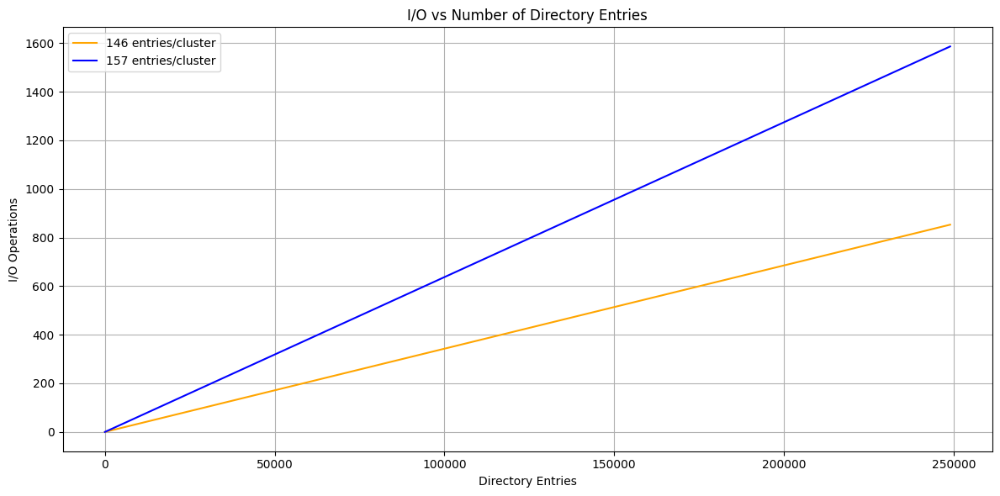
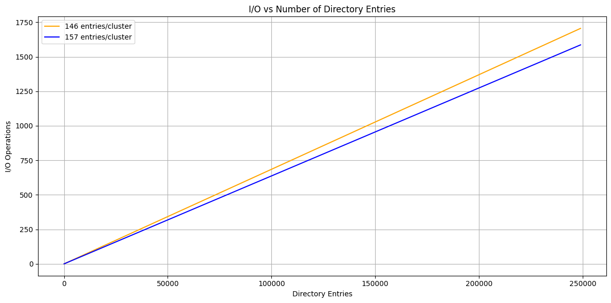

# Noise-Immune FAT32 File system
## Main goal
The main goal of this project is to make the FAT32 file system work in usage scenarios where `SEU` is common. </br>
Also this FS should work on embedded systems for my another project called [CDBMS](https://github.com/j1sk1ss/CordellDBMS.PETPRJ).

## Why?
- Firstly, I have my own project that needs a noise-immune FS.
- Secondly, we currently have ECC RAM, but we have no way to protect data in non-ROM memory from SEU.
- Thirdly, it will be cheaper if we can use software solutions instead of hardware ones.

## Current state
| TODO List:                                             |Stat:|
|--------------------------------------------------------|-----|
| Base implementation.                                   | [V] |
| Complete porting from `CordellOS` project.             | [V] |
| Implement noise-immune algorithms.                     | [?] |
| Create format tool for creating modified FS on Flashs. | [.] |
| Testing and comparing with other FS.                   | [.] |
| Conference                                             | [.] |

# Theory summary
## Abstract
I had noticed that on the entire internet, there are no attempts to bring to life the [FAT32](https://wiki.osdev.org/FAT) file system for embedded or desktop systems. Usually, users and programmers simply shift to other file systems like [EXT4](https://wiki.osdev.org/Ext4) due to many technical issues in `FAT32`, but with this decision, they lose the simplicity of the first solution. And as we all know, for the reduction of errors, things should be made simpler. </br>
`NIFAT32` itself is a project that should work in embedded systems, like the [STM32F103C6T8](https://www.st.com/en/microcontrollers-microprocessors/stm32f103c6.html), or in home-made operating systems, like mine — [CordellOS](https://github.com/j1sk1ss/CordellOS.PETPRJ). For this purpose, the target file system should be lightweight and optimized for a single-threaded environment. </br>
Why `FAT32` as base? — Simple answer: because `FAT32` is a well-known file system with strong community support and a simple data structure. Also, `FAT32` has obvious parts where it can be upgraded to work in [SEU](https://en.wikipedia.org/wiki/Single-event_upset) and embedded contexts. I am talking about these aspects:
- The File Allocation Table, which contains the entire `FAT32` logic.
- `directory_entry_t`, which is the basis for representing files in the file system.
- Data flows from disk to high-level abstractions.

## Why SEU is dangerous?
Well, `SEU`, or single event upset, is a physical event when electrons in the `CPU`, `RAM`, etc., get disturbed by ionic particles. This is very dangerous when a program controls, for example, an entire plane or space station. That's why any program solution that will work in high-evaluated systems should be prepared for `SEU`. </br>
Of course, there are a couple of solutions for reducing the impact of `SEU` on chips, like:
- [ECC](https://community.fs.com/encyclopedia/ecc-memory.html)

But the problem here is that this solution works in `RAM` instead of `Flash` memory. This means that we can say that all data in `RAM` is secured, but we can't make a similar statement about `RWM` (read/write memory). (For `ROM`, the situation is different due to technical implementation. See this [topic](https://hackernoon.com/differences-between-ram-rom-and-flash-memory-all-you-need-to-know-ghr341i) for why `ROM` is secured against `SEU`).

## Impact of SEU
For confidence in the danger of SEU to program stability, a test environment was created with fault-injection functions directly targeting memory. While we know that, in a real scenario, the program will reside in RAM with ECC, which protects against bit-flipping, the data used and stored by the program is not secured. This fact leads to many problems with user experience. </br>
For example, at about 200k bit flips we reach a situation where FAT32 (with checksum support) stops working with records:
```
...
[WARN] (nifat32.c:188) directory_entry_t checksum validation error!
[ERROR] (nifat32.c:522) Entry not found!
Can't open content!
Hundled error count: 10000
Unhundled error count: 0
```
This is due to the violation of the `directory_entry_t` file name sequence: </br>
A bit-flip occurs directly in one of the file names - `"TEST   0TXT "` (was `"TEST    TXT "`). This causes a checksum verification error. But this case does not represent a modification as a big improvement, because in the original FAT32 the same bit flip changes the file name, which will lead to the same error - `"File not found"`. One thing that in this case this error is accompanied by additional information - a checksum verification error. </br>
For a visual example here are the results of testing the unmodified FAT32 system with checksum implementation only. (X-axis: number of bit-flips in data, Y-axis: count of handled errors):

<p align="center">
	
</p>

Here we can see, that count of hundled error continue to grow after stop of bit-flip injection. In test program was implemented self-repair mechanism for re-creating broken entries:

```
if (!NIFAT32_content_exists(target_fatname)) {
	handled_errors++;
	fprintf(stderr, "File not found, but should be presented in FS!\n");

	cinfo_t file = { .type = STAT_FILE };
	str_memcpy(file.file_name, "test", 5);
	str_memcpy(file.file_extension, "txt", 4);
	name_to_fatname("test.txt", file.full_name);
	if (!NIFAT32_put_content(PUT_TO_ROOT, &file)) {
		handled_errors++;
        ... 
	}
}
```

But according to data, bit-flip happened in most dangerous zone - in file allocation table. In the end, this test doesn't make any sense due to obvious results. The `FAT32` filesystem wasn't designed to withstand upset events. The source implementation can handle cases where the FAT boot sector or allocation table is damaged (excluding direct cell value changes), but it cannot function properly when `SEU` occurs directly within clusters — for example, changing a file name. </br>
However, `FAT32` is still a solid solution for simple file storage in embedded systems. This is why certain modifications to the filesystem can improve its noise immunity and fault tolerance. Additionally, if our target is embedded systems, we can restructure the source code to reduce the overall size of the filesystem, which will simplify the process of porting it to various microcontrollers.

## File Allocation Table
As mentioned, the `File Allocation Table (FAT)` is the most important part of the `FAT32` file system. I won't explain how this table works — just check this [topic](https://en.wikipedia.org/wiki/Design_of_the_FAT_file_system). </br>
The original implementation of FAT simply saved the entire table (and its copies) in the first sectors of the disk. If we're talking about `Flash` memory — which is the cheapest solution in terms of storage capacity vs. price, according to [this article](https://nexusindustrialmemory.com/choosing-between-flash-and-eeprom-finding-the-perfect-memory-type-for-your-embedded-system/) — it comes with serious risks, especially in `embedded` systems with `SEU` effect. These risks are explained in more detail [here](https://en.wikipedia.org/wiki/Flash_memory).

The main issue is that `SEU` can disturb electrons in `Flash`, which may cause bit-flips that can silently corrupt data. If the `FAT` table is affected, the consequences can include:
- corrupter boot sector,
- corrupted file allocation table,
- corrupted file allocation metadata,
- unreadable or wrongly linked files,
- complete file system failure.

Therefore, storing such critical structures in unprotected `Flash` without redundancy or error correction makes the system vulnerable to undetectable corruption. </br>
Based on official FAT32 specifications, additional FAT table copies (typically just one extra copy) are used solely when the primary table is corrupted:
```
Typically the extra copies are kept in tight synchronization on writes, and on reads they are only used when errors occur in the first FAT.
``` 
This approach can be significantly enhanced through a voting system. Such a system leverages multiple data sources, determining the final value based on the most frequently occurring valid data. Then all copies are synchronized.

## Data structures
FAT32 has many data structures that are used during work. For example in source design we have:
- directory_entry_t - Entry structure that represent any file or directory in file system.
- fat_bootstruct - Basic data of file system and hardware specification. This structure include data about sector size, cluster size, fat offsets. Full list of fields is below:

```
typedef struct fat_BS {
	unsigned char  bootjmp[3];
	unsigned char  oem_name[8];
	unsigned short bytes_per_sector;
	unsigned char  sectors_per_cluster;
	unsigned short reserved_sector_count;
	unsigned char  table_count;
	unsigned short root_entry_count;
	unsigned short total_sectors_16;
	unsigned char  media_type;
	unsigned short table_size_16;
	unsigned short sectors_per_track;
	unsigned short head_side_count;
	unsigned int   hidden_sector_count;
	unsigned int   total_sectors_32;
	unsigned char  extended_section[sizeof(fat_extBS_32_t)];
} __attribute__((packed)) fat_BS_t;
```

- The fat32_bootstruct itself actually refers to the `fat_bootstruct`, which historically contains information only for FAT12 and FAT16 filesystems. That’s why, to support FAT32, the bootstruct includes a special field called the extended_section.

The main idea here is to provide checksum support along with a dual backup system using noise-immune encoding. Additional checksum verification reduces the probability of data corruption. For checksum generation, the `crc32` function was used, implemented according to this [article](https://arxiv.org/html/2412.16398v1). Why `crc32`? Because it is a widely adopted error-detection method, and this algorithm also has certain advantages as discussed in this [thesis](https://theses.liacs.nl/pdf/2014-2015NickvandenBosch.pdf). For noise-immune encoding, Hamming code was chosen; the reasons for this choice and implementation details will be explained below. </br>
The original solution saves the bootstruct in the first sector and stores a backup in the sixth sector. The best way to secure this critical data is through a form of "decompression" — meaning that backups are stored in sectors whose addresses are calculated using a formula based on [hash constants](https://en.wikipedia.org/wiki/Golden_ratio):

```
#define HASH_CONST 2654435761U
#define PRIME1     73856093U
#define PRIME2     19349663U
#define PRIME3     83492791U
#define GET_BOOTSECTOR(number, total_sectors) ((((number) * PRIME1 + PRIME2) * PRIME3) % (total_sectors))
```

```
Ext boot checksum: 2706677872
Boot checksum: 2250935889
[i=0] encoded bootsector has been written at ca=37545/131072!
[i=1] encoded bootsector has been written at ca=58404/131072!
[i=2] encoded bootsector has been written at ca=79263/131072!
[i=3] encoded bootsector has been written at ca=100122/131072!
[i=4] encoded bootsector has been written at ca=120981/131072!
```

This method physically decompress data on disk/flash drive:

<p align="center">
	
</p>

The next step involves modifying the original data structures to optimize them for this embedded solution. For example, the `directory_entry_t` structure. Below is the original definition:

```
typedef struct directory_entry {
	uint8_t file_name[11];
	uint8_t attributes;
	uint8_t reserved0;
	uint8_t creation_time_tenths;
	uint16_t creation_time;
	uint16_t creation_date;
	uint16_t last_accessed;
	uint16_t high_bits;
	uint16_t last_modification_time;
	uint16_t last_modification_date;
	uint16_t low_bits;
	uint32_t file_size;
} __attribute__((packed)) directory_entry_t;
```

And updated version:
```
typedef struct directory_entry {
	unsigned char file_name[11];
	unsigned char attributes;
	unsigned char reserved0;
	unsigned int  cluster;
	unsigned int  file_size;
	unsigned int  checksum;
} __attribute__((packed)) directory_entry_t;
```

As you can see, in the modified structure, six fields with a total size of 11 bytes were removed. These fields (creation and last accessed time) were excluded in the `embedded` context to save space. In embedded systems, creation and last usage timestamps are typically unnecessary due to the program’s specific requirements like:
- Saving important data without any time check.
- Reading config data without any time check.
- Updating data without any time check.

Example of such system can be `CDBMS`, [LittleDB](https://github.com/pouriamoosavi/LittleDB), [EinkPDA](https://github.com/ashtf8/EinkPDA). </br>
Additionally, `high_bits` and `low_bits` were replaced by a single `cluster` field. Historically, splitting addresses into high and low bits was justified by 16-bit target architectures, but our current target supports raw 32-bit numbers. The mechanism behind this support is described [here](https://www.reddit.com/r/arduino/comments/i3wl8f/how_do_8_bit_arduinos_handle_32bit_numbers/). </br>
With these modifications, the required space for `directory_entry_t` has been reduced, allowing us to store significantly more entries within a single cluster. </br>
In summary, this simplification of `directory_entry_t` results in fewer syscalls and I/O operations. For example, with a default cluster size of approximately `sector_size * 2^3 = 512 * 8 = 4096` bytes, instead of using 26 bytes for each `directory_entry_t`, we now use only 15 bytes. This increases the number of entries per cluster from 157 to 273. </br>
The performance improvement can be illustrated with a graph where the Y-axis represents the number of I/O operations, and the X-axis represents the number of entries in the directory:

<p align="center">
	
</p>

But if we start implementation of error-correction methods such as `Hamming Code` (Hamming code is better for single-bit errors. For large data blocks like stored data or entire FAT, we will use `Reed-Solomon code`. About implementation of this approach we will speak below), we multiply size of modified `directory_entry_t` by 2, and receive something similar to old results: 30 bytes, that in the end will lead to incrementing of syscalls count:

<p align="center">
	
</p>

## Modern solutions against SEU
The most common solution against **Single Event Upsets** (SEUs) is [Hamming encoding](https://en.wikipedia.org/wiki/Hamming_code).  
Another approach for implementing noise-immune encoding is the use of [Reed–Solomon codes](https://en.wikipedia.org/wiki/Reed%E2%80%93Solomon_error_correction). A comparison between these two error correction methods can be found in [this study](https://www.researchgate.net/publication/389098626_A_Comparative_Study_between_Hamming_Code_and_Reed-Solomon_Code_in_Byte_Error_Detection_and_Correction). </br>
Below is a basic implementation of Hamming encoding and decoding.

```
encoded_t encode_hamming_15_11(decoded_t data) {
    encoded_t encoded = 0;
    encoded = SET_BIT(encoded, 2, GET_BIT(data, 0));
    encoded = SET_BIT(encoded, 4, GET_BIT(data, 1));
    encoded = SET_BIT(encoded, 5, GET_BIT(data, 2));
    encoded = SET_BIT(encoded, 6, GET_BIT(data, 3));
    encoded = SET_BIT(encoded, 8, GET_BIT(data, 4));
    encoded = SET_BIT(encoded, 9, GET_BIT(data, 5));
    encoded = SET_BIT(encoded, 10, GET_BIT(data, 6));
    encoded = SET_BIT(encoded, 11, GET_BIT(data, 7));
    encoded = SET_BIT(encoded, 12, GET_BIT(data, 8));
    encoded = SET_BIT(encoded, 13, GET_BIT(data, 9));
    encoded = SET_BIT(encoded, 14, GET_BIT(data, 10));

    byte_t p1 = GET_BIT(encoded, 2) ^ GET_BIT(encoded, 4) ^ GET_BIT(encoded, 6) ^ GET_BIT(encoded, 8) ^ GET_BIT(encoded, 10) ^ GET_BIT(encoded, 12) ^ GET_BIT(encoded, 14);
    byte_t p2 = GET_BIT(encoded, 2) ^ GET_BIT(encoded, 5) ^ GET_BIT(encoded, 6) ^ GET_BIT(encoded, 9) ^ GET_BIT(encoded, 10) ^ GET_BIT(encoded, 13) ^ GET_BIT(encoded, 14);
    byte_t p4 = GET_BIT(encoded, 4) ^ GET_BIT(encoded, 5) ^ GET_BIT(encoded, 6) ^ GET_BIT(encoded, 11) ^ GET_BIT(encoded, 12) ^ GET_BIT(encoded, 13) ^ GET_BIT(encoded, 14);
    byte_t p8 = GET_BIT(encoded, 8) ^ GET_BIT(encoded, 9) ^ GET_BIT(encoded, 10) ^ GET_BIT(encoded, 11) ^ GET_BIT(encoded, 12) ^ GET_BIT(encoded, 13) ^ GET_BIT(encoded, 14);

    encoded = SET_BIT(encoded, 0, p1);
    encoded = SET_BIT(encoded, 1, p2);
    encoded = SET_BIT(encoded, 3, p4);
    encoded = SET_BIT(encoded, 7, p8);
    return encoded;
}

decoded_t decode_hamming_15_11(encoded_t encoded) {
    byte_t s1 = GET_BIT(encoded, 0) ^ GET_BIT(encoded, 2) ^ GET_BIT(encoded, 4) ^ GET_BIT(encoded, 6) ^ GET_BIT(encoded, 8) ^ GET_BIT(encoded, 10) ^ GET_BIT(encoded, 12) ^ GET_BIT(encoded, 14);
    byte_t s2 = GET_BIT(encoded, 1) ^ GET_BIT(encoded, 2) ^ GET_BIT(encoded, 5) ^ GET_BIT(encoded, 6) ^ GET_BIT(encoded, 9) ^ GET_BIT(encoded, 10) ^ GET_BIT(encoded, 13) ^ GET_BIT(encoded, 14);
    byte_t s4 = GET_BIT(encoded, 3) ^ GET_BIT(encoded, 4) ^ GET_BIT(encoded, 5) ^ GET_BIT(encoded, 6) ^ GET_BIT(encoded, 11) ^ GET_BIT(encoded, 12) ^ GET_BIT(encoded, 13) ^ GET_BIT(encoded, 14);
    byte_t s8 = GET_BIT(encoded, 7) ^ GET_BIT(encoded, 8) ^ GET_BIT(encoded, 9) ^ GET_BIT(encoded, 10) ^ GET_BIT(encoded, 11) ^ GET_BIT(encoded, 12) ^ GET_BIT(encoded, 13) ^ GET_BIT(encoded, 14);
    byte_t error_pos = s1 + (s2 << 1) + (s4 << 2) + (s8 << 3);
    if (error_pos) encoded = TOGGLE_BIT(encoded, (error_pos - 1));
    
    decoded_t data = 0;
    data = SET_BIT(data, 0, GET_BIT(encoded, 2));
    data = SET_BIT(data, 1, GET_BIT(encoded, 4));
    data = SET_BIT(data, 2, GET_BIT(encoded, 5));
    data = SET_BIT(data, 3, GET_BIT(encoded, 6));
    data = SET_BIT(data, 4, GET_BIT(encoded, 8));
    data = SET_BIT(data, 5, GET_BIT(encoded, 9));
    data = SET_BIT(data, 6, GET_BIT(encoded, 10));
    data = SET_BIT(data, 7, GET_BIT(encoded, 11));
    data = SET_BIT(data, 8, GET_BIT(encoded, 12));
    data = SET_BIT(data, 9, GET_BIT(encoded, 13));
    data = SET_BIT(data, 10, GET_BIT(encoded, 14));
    return data;
}
```

The main limitation of this algorithm is its restricted error correction capability: it can correct a single-bit error and detect (but not correct) double-bit errors. This makes it insufficient in environments with frequent or multiple simultaneous bit-flips. Also this method requires additional space for control bits, that itself not a big problem, if we don't speak about sectors. </br>
**Sectors** are the lowest abstraction that divide the disk into the smallest possible sections. Every disk IO syscall loads an entire sector from the disk into memory. A basic implementation looks like the code below (the code was taken from the CordellOS project):

```
int ATA_read_sector(uint32_t lba, uint8_t* buffer) {
	_ata_wait();
	_prepare_for_reading(lba);
	if (!_is_ata_ready()) {
		return 0;
	}

	for (int n = 0; n < SECTOR_SIZE / 2; n++) {
		uint16_t value = i386_inw(DATA_REGISTER);
		buffer[n * 2] = value & 0xFF;
		buffer[n * 2 + 1] = value >> 8;
	}

	return 1;
}

int ATA_write_sector(uint32_t lba, const uint8_t* buffer) {
	if (lba == BOOT_SECTOR) return -1;

	_ata_wait();
	_prepare_for_writing(lba);

	int timeout = 9000000;
	while ((i386_inb(STATUS_REGISTER) & ATA_SR_BSY) == 0) 
		if (--timeout < 0) return -1;
		else continue;
	
	for (int i = 0; i < SECTOR_SIZE / 2; i++) {
		uint16_t data = *((uint16_t*)(buffer + i * 2));
		i386_outw(DATA_REGISTER, data);
	}

	return 1;
}
```

That's why this part is tricky when we need to encode some data that fits exactly into one sector using Hamming code, as it will increase the size by 2 bytes at the end. </br>
If we are talking about the **boot sector**, there is no problem here because this data easily fits into one entire sector even after additional encoding. However, when it comes to the `FAT`, it is difficult to determine the best approach for retrieving data from the encoded disk space.

## Benchmark

## References
- FAT32 carcase was taken from my OS project on [github](https://github.com/j1sk1ss/CordellOS.PETPRJ) 
- FS API itself was built with help of this [topic](https://wiki.osdev.org/FAT)
- SEU [topic](https://en.wikipedia.org/wiki/Single-event_upset)
- ECC [topic](https://community.fs.com/encyclopedia/ecc-memory.html)

