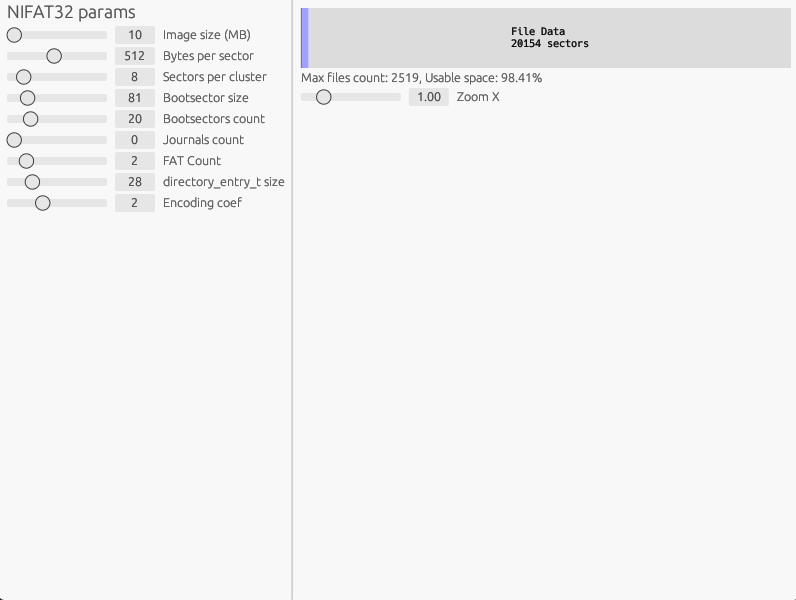

# Efficiency app
This is a RUST application for space efficiency emulation. 

# How it works?
This is a simple app with several parameters for getting usefull space during work with NIFAT32.

    

